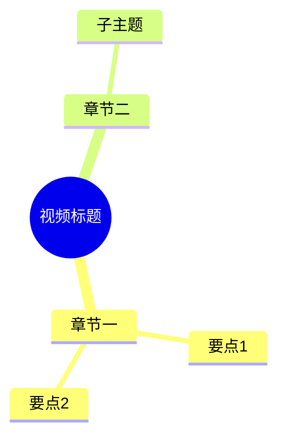

# AI 功能扩展方案 — 实施文档

> 最后更新：2026-06-28  
> 基于：`docs/竞品调研报告.md` + 功能需求优先级表

---

## 一、项目文件结构

```
free-video-downloader/
├── main.py                       # 入口：uvicorn 启动 FastAPI
├── config.py                     # 全局配置（含 .env 自动加载）
├── requirements.txt              # Python 依赖
├── .env                          # DeepSeek API Key（不提交 git）
├── .env.example                  # API Key 模板
├── cookies.txt                   # YouTube/Bilibili/Douyin cookies
│
├── backend/
│   ├── api.py                    # 🆕 18 个 API 端点
│   ├── downloader.py             # yt-dlp 下载引擎（原有）
│   ├── queue.py                  # 🆕 任务队列抽象层（适配器模式）
│   ├── subtitle.py               # 🆕 YouTube 字幕提取
│   ├── ai.py                     # 🆕 DeepSeek API 封装（总结/问答/导图）
│   ├── prompts.py                # 🆕 Prompt 模板
│   ├── transcribe.py             # 🆕 Whisper 本地转录
│   ├── _whisper_worker.py        # 🆕 Whisper 子进程 worker
│   ├── models.py                 # 🔄 Pydantic 数据模型（25+）
│   └── douyin/                   # 抖音专用模块（原有）
│       ├── api.py
│       ├── xbogus.py
│       └── abogus.py
│
├── frontend/                     # Vue 3 + Vite 前端（原有，待集成新 API）
│   └── src/
│       ├── App.vue
│       └── components/
│
├── docs/
│   ├── 竞品调研报告.md
│   ├── AI功能扩展方案.md          # 本文档
│   ├── design.md
│   └── requirements.md
│
└── downloads/                    # 下载/字幕/上传 输出目录
    ├── *.mp4 / *.webm / *.mkv    # 下载的视频文件
    ├── subtitles/                # 🆕 字幕提取输出
    │   └── <video_id>/
    │       ├── <lang>.srt
    │       ├── <lang>.txt
    │       └── manifest.json
    └── uploads/                  # 🆕 用户上传的临时文件
```

> 图例：🆕 本轮新增 | 🔄 本轮修改 | 原有 未改动

---

## 二、新增功能总览

### Sprint 1 — 字幕提取 + 任务队列

| 端点 | 方法 | 说明 |
|------|------|------|
| `/api/subtitles` | POST | 提交字幕提取任务 |
| `/api/subtitles/{task_id}` | GET | 查询字幕提取结果 |

**能力**：输入 YouTube URL → yt-dlp 提取字幕 → 输出 `.srt` + `.txt` + `manifest.json`

**新增文件**：`backend/queue.py`、`backend/subtitle.py`

---

### Sprint 2 — P0 视频 AI 总结

| 端点 | 方法 | 说明 |
|------|------|------|
| `/api/summary` | POST | 提交视频总结任务 |
| `/api/summary/{task_id}` | GET | 查询总结结果 |

**能力**：URL → 字幕 → DeepSeek AI 总结 → 结构化 JSON（一句话摘要 + 章节 + 要点 + 标签）

**返回格式**：
```json
{
  "one_liner": "一句话总结",
  "chapters": [{"timestamp": "00:00", "title": "章节标题"}],
  "key_points": ["要点1", "要点2"],
  "tags": ["标签1", "标签2"]
}
```

**新增文件**：`backend/ai.py`（`summarize_video`）、`backend/prompts.py`（`summarize_prompt`）

---

### Sprint 3 — P1 思维导图

| 端点 | 方法 | 说明 |
|------|------|------|
| `/api/mindmap` | POST | 提交思维导图生成 |
| `/api/mindmap/{task_id}` | GET | 查询 Mermaid 代码 |

**能力**：URL → 字幕 → DeepSeek → Mermaid mindmap 语法

**返回格式**：


**新增**：`prompts.py`（`mindmap_prompt`）、`ai.py`（`generate_mindmap`）

---

### Sprint 4 — P2 AI 问答

| 端点 | 方法 | 说明 |
|------|------|------|
| `/api/ask` | POST | 提交视频问答 |
| `/api/ask/{task_id}` | GET | 查询回答 |

**能力**：基于视频字幕的智能问答，支持多轮对话（通过 `history` 参数传递上下文）

**请求示例**：
```json
{
  "url": "https://www.youtube.com/watch?v=xxx",
  "question": "这个视频讲了什么？",
  "lang": "zh",
  "history": [
    {"question": "上一个问题", "answer": "上一个回答"}
  ]
}
```

**新增**：`prompts.py`（`question_prompt`）、`ai.py`（`ask_video`）

---

### Sprint 5 — 本地转录 + 批量队列

| 端点 | 方法 | 说明 |
|------|------|------|
| `/api/transcribe` | POST | 上传本地文件，Whisper 转录 |
| `/api/transcribe/{task_id}` | GET | 查询转录结果 |
| `/api/batch` | POST | 批量提交多个 URL |
| `/api/batch/{batch_id}` | GET | 查询批量进度 |

**能力**：
- 上传 `.mp3`/`.mp4`/`.wav` 等音频文件 → 本地 Whisper（base 模型）转录 → 返回文本 + 带时间戳的分段
- 一次提交多个视频 URL → 并行下载 → 状态聚合查询

**新增文件**：`backend/transcribe.py`、`backend/_whisper_worker.py`

---

## 三、原有功能保持不变

| 端点 | 说明 |
|------|------|
| `GET /api/health` | 健康检查 |
| `POST /api/info` | 解析视频信息（YouTube/Bilibili/Douyin） |
| `POST /api/download` | 下载视频（已接入任务队列） |
| `GET /api/progress/{task_id}` | 下载进度 |
| `GET /api/files` | 已下载文件列表 |
| `DELETE /api/files/{filename}` | 删除文件 |
| `GET /api/download/{filename}` | 播放/下载文件 |

---

## 四、使用指南

### 4.1 环境准备

```bash
# 1. 安装依赖
pip install -r requirements.txt

# 2. 确保 ffmpeg 已安装（下载/Whisper 依赖）
#    Windows: 下载 ffmpeg.exe 放到 PATH 或项目根目录
#    macOS: brew install ffmpeg
#    Linux: apt install ffmpeg

# 3. 配置 DeepSeek API Key
cp .env.example .env
# 编辑 .env，填入真实的 API Key：
#   DEEPSEEK_API_KEY=sk-xxxxx
```

### 4.2 启动服务

```bash
python main.py
# 服务启动在 http://127.0.0.1:8001
# Swagger 文档：http://127.0.0.1:8001/docs
```

### 4.3 API 调用示例

#### 下载视频

```bash
# 1. 解析视频信息
curl -X POST http://127.0.0.1:8001/api/info \
  -H "Content-Type: application/json" \
  -d '{"url": "https://www.youtube.com/watch?v=jNQXAC9IVRw"}'

# 2. 下载
curl -X POST http://127.0.0.1:8001/api/download \
  -H "Content-Type: application/json" \
  -d '{"url": "https://www.youtube.com/watch?v=jNQXAC9IVRw", "format_id": "bestvideo+bestaudio/best"}'

# 3. 查看进度
curl http://127.0.0.1:8001/api/progress/<task_id>
```

#### 字幕提取 + AI 总结

```bash
# 1. 提取字幕
curl -X POST http://127.0.0.1:8001/api/subtitles \
  -H "Content-Type: application/json" \
  -d '{"url": "https://www.youtube.com/watch?v=jNQXAC9IVRw", "languages": ["en"]}'

# 2. 查询结果
curl http://127.0.0.1:8001/api/subtitles/<task_id>

# 3. AI 总结（自动提取字幕 + AI）
curl -X POST http://127.0.0.1:8001/api/summary \
  -H "Content-Type: application/json" \
  -d '{"url": "https://www.youtube.com/watch?v=jNQXAC9IVRw", "lang": "zh"}'

# 4. 查询
curl http://127.0.0.1:8001/api/summary/<task_id>
```

#### 思维导图

```bash
curl -X POST http://127.0.0.1:8001/api/mindmap \
  -H "Content-Type: application/json" \
  -d '{"url": "https://www.youtube.com/watch?v=jNQXAC9IVRw", "lang": "zh"}'

curl http://127.0.0.1:8001/api/mindmap/<task_id>
# 返回 mermaid 字段，可直接用 Mermaid.js 渲染
```

#### AI 问答（多轮）

```bash
# 第一轮
curl -X POST http://127.0.0.1:8001/api/ask \
  -H "Content-Type: application/json" \
  -d '{
    "url": "https://www.youtube.com/watch?v=jNQXAC9IVRw",
    "question": "视频里提到了什么动物？",
    "lang": "zh"
  }'

# 第二轮（带上下文）
curl -X POST http://127.0.0.1:8001/api/ask \
  -H "Content-Type: application/json" \
  -d '{
    "url": "https://www.youtube.com/watch?v=jNQXAC9IVRw",
    "question": "它有什么特点？",
    "lang": "zh",
    "history": [{"question": "视频里提到了什么动物？", "answer": "大象"}]
  }'
```

#### 本地文件转录

```bash
curl -X POST http://127.0.0.1:8001/api/transcribe \
  -F "file=@/path/to/audio.mp3"

curl http://127.0.0.1:8001/api/transcribe/<task_id>
# 返回 { text, segments: [{start, end, text}], language, duration }
```

#### 批量下载

```bash
curl -X POST http://127.0.0.1:8001/api/batch \
  -H "Content-Type: application/json" \
  -d '{
    "urls": [
      "https://www.youtube.com/watch?v=xxx",
      "https://www.youtube.com/watch?v=yyy"
    ]
  }'

curl http://127.0.0.1:8001/api/batch/<batch_id>
# 返回所有子任务状态聚合
```

---

## 五、架构设计要点

### 5.1 任务队列（适配器模式）

```
              get_queue()
                  │
          ┌───────┴───────┐
          │ QueueBackend  │  ← 抽象接口
          │ (ABC)         │
          └───────┬───────┘
                  │
     ┌────────────┼────────────┐
     │                         │
_InMemoryBackend         _CeleryBackend  ← 将来换一行注册即可
(asyncio.Semaphore)      (TODO)
```

### 5.2 处理流水线

```
URL / 文件
    │
    ├─→ yt-dlp 下载 ──→ 本地文件
    │
    ├─→ yt-dlp 字幕 ──→ .srt / .txt
    │                        │
    │         ┌──────────────┼──────────────┐
    │         │              │              │
    │     DeepSeek        DeepSeek       DeepSeek
    │     总结生成        导图生成       问答生成
    │         │              │              │
    │     JSON 摘要      Mermaid        答案文本
    │
    └─→ Whisper 转录 ──→ 文本 + 时间戳
```

### 5.3 关键依赖

| 依赖 | 版本 | 用途 |
|------|------|------|
| fastapi | ≥0.100 | Web 框架 |
| yt-dlp | ≥2024.0 | 下载 + 字幕 |
| openai | ≥1.0 | DeepSeek API（OpenAI 兼容） |
| openai-whisper | 20250625 | 本地语音转文字 |
| aiohttp | ≥3.8 | 异步 HTTP |
| python-dotenv | ≥1.0 | .env 加载 |

---

## 六、后续规划

| 阶段 | 内容 | 优先级 |
|------|------|:---:|
| Sprint 6 | AI 内容改写（公众号/小红书/Twitter 风格） | 低 |
| Sprint 7 | 积分/订阅商业化 | 低 |
| 前端集成 | Vue 组件对接新 API 端点 | 中 |
| 多平台字幕 | Bilibili / Douyin 字幕支持 | 中 |
| 队列升级 | Celery + Redis 替代内存队列 | 低 |
